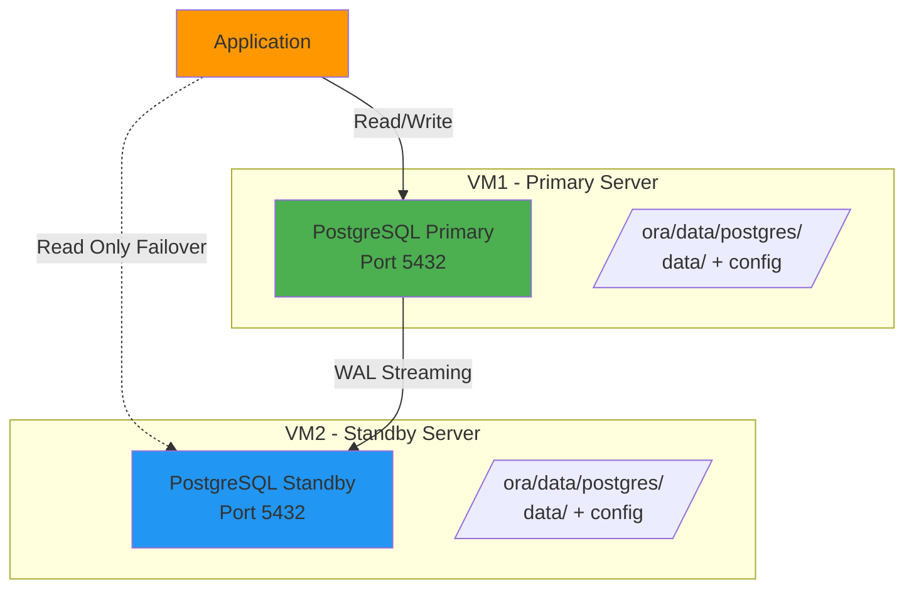

# PostgreSQL 17 – Primary / Standby (Docker)

Streaming Replication with Manual Failover

## 🏗️ Architecture



## 📋 Overview

This setup provides a production-ready PostgreSQL 17 replication system with:

- **VM1** → Primary PostgreSQL (read/write)
- **VM2** → Standby PostgreSQL (read-only, streaming replication)
- **Replication** → Physical WAL streaming
- **Failover** → Manual promotion using `pg_promote()`

### Directory Structure (Per VM)

```
/ora/data/postgres/
├── data/              # PostgreSQL data directory
└── config/            # Configuration files
    ├── postgresql.conf
    └── pg_hba.conf
```

⚠️ **Important**: Each VM must use its own local `/ora/data/postgres/` directory. Do NOT share this between VMs.

## 🚀 Setup Instructions

### Prerequisites

- Docker and Docker Compose installed on both VMs
- Network connectivity between VM1 and VM2 on port 5432
- Root or sudo access to create directories

### 1. Configure Environment Variables

**On Primary VM:**

```bash
# Copy the example file
cp .env.primary.example .env.primary

# Edit with your actual values
nano .env.primary
```

Update these values in `.env.primary`:
- `POSTGRES_PASSWORD` - Your database password
- `REPLICATION_PASSWORD` - Your replication password
- `STANDBY_IP` - IP address of your standby server

**On Standby VM:**

```bash
# Copy the example file
cp .env.standby.example .env.standby

# Edit with your actual values
nano .env.standby
```

Update these values in `.env.standby`:
- `POSTGRES_PASSWORD` - Same as primary
- `REPLICATION_PASSWORD` - Same as primary
- `PRIMARY_IP` - IP address of your primary server

⚠️ **Security**: Never commit `.env.primary` or `.env.standby` to version control!

### 2. Prepare Directories (Both VMs)

```bash
sudo mkdir -p /ora/data/postgres/{data,config}
sudo chown -R 999:999 /ora/data/postgres
```

### 3. Setup Primary (VM1)

```bash
# Copy configuration files
sudo cp config/postgresql.conf /ora/data/postgres/config/
sudo cp config/pg_hba.conf /ora/data/postgres/config/

# Update pg_hba.conf with standby IP (use the value from .env.primary)
sudo sed -i 's/STANDBY_IP/YOUR_STANDBY_IP/g' /ora/data/postgres/config/pg_hba.conf

# Start primary
docker compose -f docker-compose-primary.yml up -d

# Wait for PostgreSQL to be ready
sleep 5

# Create replication user (use values from .env.primary)
docker exec -it pg-primary psql -U ${POSTGRES_USER:-awx} -c "
CREATE ROLE ${REPLICATION_USER:-replicator} 
  WITH REPLICATION 
  LOGIN 
  PASSWORD 'YOUR_REPLICATION_PASSWORD';
"

# Reload configuration
docker exec -it pg-primary psql -U ${POSTGRES_USER:-awx} -c "SELECT pg_reload_conf();"
```

Or w4. Setup Standby (VM2)

```bash
# Load environment variables
source .env.standby

# Copy configuration files
sudo cp config/postgresql.conf /ora/data/postgres/config/
sudo cp config/pg_hba.conf /ora/data/postgres/config/

# Take base backup from primary
docker run --rm \
  -e PGPASSWORD="$REPLICATION_PASSWORD" \
  -v /ora/data/postgres/data:/backup \
  postgres:17 \
  pg_basebackup \
    -h $PRIMARY_IP \
    -U $REPLICATION_USERg-primary psql -U $POSTGRES_USER -c "
CREATE ROLE $REPLICATION_USER 
  WITH REPLICATION 
  LOGIN 
  PASSWORD '$REPLICATION_PASSWORD';
"

# Reload configuration
docker exec -it pg-primary psql -U $POSTGRES_USER -c "SELECT pg_reload_conf();"
```

### 3. Setup Standby (VM2)

```bash
# Copy configuration files
sudo cp config/postgresql.conf /ora/data/postgres/config/
sudo cp config/pg_hba.conf /ora/data/postgres/config/

# Take base backup from primary (replace PRIMARY_IP with your primary server IP)
docker run --rm \
  -e PGPASSWORD='strong_replication_password' \
  -v /ora/data/postgres/data:/backup \
  postgres:17 \
  pg_basebackup \
    -h PRIMARY_IP \
    -U replicator \
    -D /backup \
    -P \
    -R

# Fix permissions
sudo chown -R 999:999 /ora/data/postgres/data
sudo chmod 700 /ora/data/postgres/data

# Start standby
dock5r compose -f docker-compose-standby.yml up -d
```

### 4. Verify Replication

```bash
# Check on primary
docker exec -it pg-primary psql -U awx -c "
SELECT usename, client_addr, state 
FROM pg_stat_replication;
"

# Check standby status
docker exec -it pg-standby psql -U awx -c "SELECT pg_is_in_recovery();"
# Should return: t (true = standby mode)
```

## 🔍 Configuration Details

### postgresql.conf (Both Nodes)

Key replication parameters:

```ini
listen_addresses = '*'           # Listen on all interfaces
wal_level = replica              # Enable replication
max_wal_senders = 10             # Max concurrent WAL senders
max_replication_slots = 10       # Max replication slots
wal_keep_size = 1GB              # Keep 1GB of WAL files
hot_standby = on                 # Allow read queries on standby
wal_log_hints = on               # Required for replication
wal_compression = on             # Compress WAL data
```

### pg_hba.conf (Primary)

Update `STANDBY_IP` with your standby server IP address:

```
# Replication connection from standby
host replication replicator STANDBY_IP/32 scram-sha-256

# Application connections
host all all 0.0.0.0/0 scram-sha-256
```

## 🔄 Manual Failover Procedure

### When to Failover

- Primary VM failure
- Planned maintenance on primary
- Data center switching

### Failover Steps

1. **Stop primary (if accessible):**

```bash
docker stop pg-primary
```

2. **Promote standby to primary:**

```bash
docker exec -it pg-standby psql -U awx -c "SELECT pg_promote();"
```

3. **Verify promotion:**

```bash
docker exec -it pg-standby psql -U awx -c "SELECT pg_is_in_recovery();"
# Should return: f (false = now primary)
```

4. **Update application connection string** to point to the new primary (VM2)

### After Failover

⚠️ **Critical**: Do NOT start the old primary without reinitializing it first!

To rejoin the old primary as a new standby:

```bash
# On old primary (VM1)
docker stop pg-primary
sudo rm -rf /ora/data/postgres/data/*

# Load environment variables (you'll need a .env.standby on old primary now)
source .env.standby

# Take new base backup from new primary (VM2)
docker run --rm \
  -e PGPASSWORD="$REPLICATION_PASSWORD" \
  -v /ora/data/postgres/data:/backup \
  postgres:17 \
  pg_basebackup \
    -h $PRIMARY_IP \
    -U $REPLICATION_USER \
    -D /backup \
    -P \
    -R

# Fix permissions
sudo chown -R 999:999 /ora/data/postgres/data
sudo chmod 700 /ora/data/postgres/data

# Start as standby
docker compose -f docker-compose-standby.yml up -d
```

## 🧪 Testing Replication

### Test Data Replication

On primary:

```sql
CREATE TABLE repl_test(id int, created_at timestamp);
INSERT INTO repl_test VALUES (1, now());
```

On standby (should replicate within seconds):

```sql
SELECT * FROM repl_test;
```

### Check Replication Lag

On standby:

```sql
SELECT now() - pg_last_xact_replay_timestamp() AS replication_lag;
```

## 📊 Monitoring Commands

### Check Node Role

```sql
SELECT pg_is_in_recovery();
-- t (true)  = standby
-- f (false) = primary
```

### View Replication Status (Primary)

```sql
SELECT usename, client_addr, state, sync_state
FROM pg_stat_replication;
```

### Check WAL Receiver (Standby)

```sql
SELECT status, received_lsn
FROM pg_stat_wal_receiver;
```

## 📁 Files Included

```.gitignore                         # Git ignore file
├── .env.primary.example               # Example environment file for primary
├── .env.standby.example               # Example environment file for standby
├── docker-compose-primary.yml         # Primary node compose file
├── docker-compose-standby.yml         # Standby node compose file
└── config/
    ├── postgresql.conf                # PostgreSQL configuration
    └── pg_hba.conf                    # Authentication configuration
```

**Note**: After copying `.env.*.example` files, the actual `.env.primary` and `.env.standby` files will be ignored by git. config/
    ├── postgresql.conf                # PostgreSQL configuration
    └── pg_hba.conf                    # Authentication configuration
```

## ⚠️ Important Notes

1. **No Automatic Failover**: This setup requires manual intervention to promote standby
2. **Application Update**: After failover, update your application's database connection string
3. **Network Security**: Ensure firewall rules allow PostgreSQL traffic (port 5432) between VMs
4. **Passwords**: Change default passwords (`awx`, `strong_replication_password`) in production!
5. **Environment Variables** ✅:
   - All sensitive data is now in `.env` files
   - `.env` files are excluded from version control via `.gitignore`
   - Use strong passwords (minimum 16 characters, mixed case, numbers, symbols)

2. **Password Best Practices**:
   - Generate strong passwords: `openssl rand -base64 32`
   - Keep `.env.primary` and `.env.standby` secure
   - Never commit `.env` files to git
   - Rotate passwords periodically

3. **Restrict network access**:
   - Update `STANDBY_IP` in `pg_hba.conf` with actual standby IP
   - Configure firewall to allow only necessary connections
   - Use VPN or private network between VMs

4. **Use SSL/TLS** (optional):
   - Configure SSL certificates for encrypted replication

5. **Regular updates**:
   - Keep PostgreSQL Docker image updated
   - Monitor security advisories
3. **Use SSL/TLS** (optional):
   - Configure SSL certificates for encrypted replication

4. **Regular updates**:
   - Keep PostgreSQL Docker image updated

## 🐛 Troubleshooting

### Replication Not Working

1. Check network connectivity:
```bash
telnet PRIMARY_IP 5432
# Test connection to primary
telnet PRIMARY_IP 5432
# Or use PowerShell: Test-NetConnection PRIMARY_IP -Port 5432
```

2. Verify replication user exists:
```bash
docker exec -it pg-primary psql -U awx -c "SELECT rolname, rolreplication FROM pg_roles WHERE rolname='replicator';"
```

3. Check logs:
```bash
docker logs pg-primary
docker logs pg-standby
```

4. Verify pg_hba.conf allows replication:
```bash
docker exec -it pg-primary cat /etc/postgresql/pg_hba.conf

### Standby Won't Start

1. Check permissions:
```bash
ls -la /ora/data/postgres/data
# Should be owned by 999:999
sudo chown -R 999:999 /ora/data/postgres/data
sudo chmod 700 /ora/data/postgres/data
```

2. Verify base backup completed:
```bash
ls -la /ora/data/postgres/data/
# Should contain PG_VERSION, postgresql.auto.conf, etc.
```

### High Replication Lag

1. Check network bandwidth between VMs
2. Increase `wal_keep_size` if needed
3. Monitor disk I/O on standby

## 📚 Additional Resources

- [PostgreSQL Replication Documentation](https://www.postgresql.org/docs/17/high-availability.html)
- [pg_basebackup Reference](https://www.postgresql.org/docs/17/app-pgbasebackup.html)
- [Streaming Replication](https://www.postgresql.org/docs/17/warm-standby.html#STREAMING-REPLICATION)

## 📄 License

This setup guide is provided as-is for educational and production use.

---

**Version**: 1.0  
**PostgreSQL Version**: 17  
**Last Updated**: December 2025
